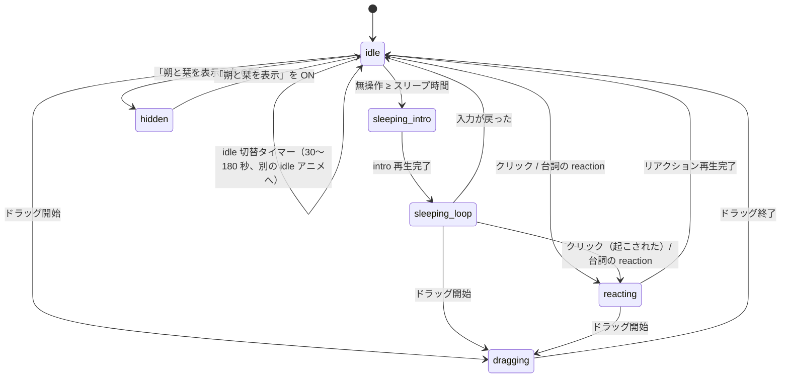

# 朔と栞 (Enoki)

macOS のデスクトップに常駐する 2 人組マスコットです。Codex の Pet 用スプライトシート
（`~/.codex/pets/sakushio_pet`）をそのまま読み込んで、透明ウィンドウの中で動かします。

- **ネットワーク通信・テレメトリ・外部プロセス起動は一切しません。**
- **アクセシビリティ／画面収録／入力監視の権限を要求しません。**
- 設定は `UserDefaults` のみ。ログは `os.Logger`（subsystem `com.enoki.mascot`）のみで、ファイルには書きません。
- Swift Package Manager だけでビルドします（`.xcodeproj` はありません）。

---

## 1. すぐ使う

```bash
make app          # .app を build/Enoki.app に組み立てる
make run          # 組み立てて起動する
make install      # ~/Applications へインストール
make test         # ユニットテスト
```

メニューバーに人が 2 人並んだアイコン（`person.2.fill`）が出れば起動しています。
Dock には出ません（`LSUIElement`）。

---

## 2. アーキテクチャ

### ターゲット構成

| ターゲット | 依存 | 役割 |
|---|---|---|
| `EnokiCore` | Foundation / CoreGraphics / ImageIO | AppKit に依存しない純ロジック。スキンの読み込み、状態遷移、位置計算、設定。**テスト対象はここ。** |
| `Enoki` | AppKit + `EnokiCore` | 実行ファイル。ウィンドウ・描画・タイマー・メニューバー・システム連携。 |
| `EnokiCoreTests` | XCTest + `EnokiCore` | 106 件のユニットテスト。 |

### ファイル

```
Sources/EnokiCore/
  Skin/SkinModels.swift          SpriteSheet / SpriteAnimation / StateMapping / Skin / SkinError
  Skin/CodexPetDefaults.swift    Codex Pet 形式の既定グリッド・9 行の定義・既定 states
  Skin/CodexPetLoader.swift      pet.json 形式のローダ（+ mascot 拡張キー）
  Skin/StripManifestLoader.swift manifest.json（ストリップ形式）のローダ
  Skin/SkinLoader.swift          形式判定と解決順
  Skin/AlphaMask.swift           ヒットテスト用アルファマスク
  State/MascotState.swift        状態の列挙
  State/MascotStateMachine.swift 状態遷移（純ロジック・タイマー非依存）
  Settings/AppSettings.swift     UserDefaults ラッパと変更通知
  Geometry/WindowPlacement.swift 位置のクランプ・既定位置（純関数）
  Dialogue/DialogueModels.swift  Speaker / DialogueCategory / DialogueLine / Conversation / DialogueSet
  Dialogue/DialogueLoader.swift  dialogue.json のローダ（壊れた会話だけ捨てる）
  Dialogue/ActivityMode.swift    仕事中モード（work / rest）
  Dialogue/QuietMode.swift       「静かにして」の状態
  Dialogue/ConversationHistory.swift  会話履歴（UserDefaults へ JSON 保存）
  Dialogue/ConversationProvider.swift ConversationContext と会話の選択（差し替え可能）
  Dialogue/ConversationScheduler.swift いつ・どのカテゴリを話すか（純ロジック）
  Appearance/AppearanceProfile.swift       見た目プロファイルの定義と allowedCategories
  Appearance/AppearanceProfileLoader.swift profiles.json のローダ（壊れた項目だけ捨てる）
  Appearance/AppearanceResolver.swift      どのプロファイルで立つかを決める純関数

Sources/Enoki/
  main.swift                     NSApplication のセットアップ
  AppDelegate.swift              MascotController と StatusMenuController の生成
  Mascot/MascotWindow.swift      NSPanel サブクラス（透明・非アクティブ化）
  Mascot/MascotView.swift        CALayer 描画・アルファヒットテスト・ドラッグ/クリック
  Mascot/SpritePlayer.swift      コマ送り（DispatchSourceTimer をコマごとに再スケジュール）
  Mascot/MascotController.swift  全部の結線（+ 内蔵リソースの解決）
  MenuBar/StatusMenuController.swift  NSStatusItem とメニュー
  Appearance/AppearanceCoordinator.swift  プロファイルの解決・スプライトセットの探索・フェード付き差し替え
  System/IdleMonitor.swift       無操作時間のポーリング
  System/LoginItemManager.swift  SMAppService によるログイン項目
  Resources/DefaultSkin/         内蔵スキン（pet.json + spritesheet.png）
  Resources/Profiles/profiles.json  見た目プロファイルの定義（§12）
  Resources/Characters/          内蔵スプライトセット置き場（現在は README のみ）
  Resources/AppIcon/icon-1024.png
```

### データフロー

```
  UserDefaults ──► AppSettings ──(NotificationCenter)──► MascotController
                                                            │
  ~/.codex/pets ──► SkinLoader ──► Skin ─────────────────────┤
                                                            │
  CGEventSource ──► IdleMonitor ──(秒数)──► MascotStateMachine
                                               │  Effect (play / schedule / pause …)
                                               ▼
                        SpritePlayer ──(コマ)──► MascotView ──► CALayer.contentsRect
                                                            └─► MascotWindow (NSPanel)

  時計（60 秒 tick）──► ConversationScheduler ──► ConversationProvider ──► ConversationPresenter
                                                                              │
                                              SpeechBubbleWindow（MascotWindow の子ウィンドウ）◄┘
```

会話・声かけは **§11** を参照してください。時刻と自分の状態しか見ません（入力内容・画面・
ファイル・アクティブアプリは読みません）。

`MascotStateMachine` は `Date` もタイマーも触りません。`handle(_ event:, now:) -> [Effect]` という
純粋な関数として書かれていて、時刻・乱数は外から注入します。実際のタイマーは
`MascotController` が `DispatchSourceTimer` で持ちます。これによって状態遷移だけを単体テストできます。

---

## 3. 使用している macOS API（すべて公開 API・権限不要）

| API | 用途 | 権限 |
|---|---|---|
| `NSPanel`（`.borderless` + `.nonactivatingPanel`） | 透明・枠なし・クリックしてもアプリがアクティブにならないウィンドウ | 不要 |
| `NSWindow.collectionBehavior` | 全スペースに表示 / フルスクリーン補助 | 不要 |
| `CALayer.contents` + `contentsRect` | スプライトシートの表示とコマ切替 | 不要 |
| `CATransaction.setDisableActions(true)` | 暗黙アニメーションの抑制 | 不要 |
| `CGImageSource`（ImageIO） | PNG / WebP のデコード | 不要 |
| `CGContext`（`alphaOnly`） | ヒットテスト用アルファマスクの生成 | 不要 |
| `CGEventSource.secondsSinceLastEventType` | 無操作時間の取得（**入力内容は取得しない**） | 不要 |
| `DispatchSourceTimer` | コマ送り・idle 切替・無操作ポーリング | 不要 |
| `NSWindow.addChildWindow(_:ordered:)` | 吹き出しをマスコット窓に追従させる | 不要 |
| `NSBezierPath` / `NSTextField` | 吹き出しの描画と文字組み | 不要 |
| `NSStatusItem` / `NSMenu` / `NSMenuDelegate` | メニューバー | 不要 |
| `NSImage(systemSymbolName:)` | メニューバーアイコン（SF Symbols） | 不要 |
| `NSOpenPanel` | スキンフォルダの選択 | 不要（ユーザーが選んだ範囲のみ） |
| `SMAppService.mainApp` | ログイン時の自動起動 | 不要（「システム設定 > 一般 > ログイン項目」に表示される） |
| `NSWorkspace.shared.notificationCenter` | スリープ／復帰、ユーザー切替の検知 | 不要 |
| `NSWindow.didChangeOcclusionStateNotification` | 完全に隠れたら再生を止める | 不要 |
| `NSApplication.didChangeScreenParametersNotification` | 画面構成の変化で位置を再検証 | 不要 |
| `UserDefaults` | 設定の保存 | 不要 |
| `os.Logger` | ログ（subsystem `com.enoki.mascot`） | 不要 |

**使っていないもの**: ネットワーク（URLSession 等）、Accessibility API、CGEventTap、
画面収録（CGWindowListCreateImage 等）、`NSTask` / `Process`、private API。

---

## 4. スプライト再生方式

- スプライトシートは **1 枚の `CGImage`** として読み込み、`layer.contents` に一度だけ設定します。
- コマ切替は **`layer.contentsRect`（単位座標）を書き換えるだけ**です。`SpriteAnimation.contentsRect`
  は左上原点ですが、macOS の CALayer（非 flipped ビュー）では contentsRect の原点が左下になるため、
  `MascotView.layerContentsRect` で Y を反転してから渡します（反転し忘れると行が上下逆になり、
  別の行のアニメーションが表示されます）。
  ビットマップの再生成も `draw(_:)` も行いません。
  `CATransaction.setDisableActions(true)` で暗黙アニメーションを止めています。
- タイマーは `DispatchSourceTimer`（main queue）で、**そのコマの表示時間ぶんだけ待って再スケジュール**します。
  Codex の素材はコマごとに表示時間が違う（例: idle は 280/110/110/140/140/320 ms）ため、
  固定 fps ループでは正しく再現できません。CADisplayLink も 60fps ループも使いません。
  `leeway` は 15ms で、OS がタイマーを束ねられるようにしています。
- **コマが 1 枚のループはタイマーを立てません**（完全な静止画になり CPU を使いません）。
- idle の実効フレームレートは概ね 3〜9fps 程度です（1 ループ約 1.1 秒に 6 コマ）。

### 再生を止める条件

| 条件 | 動作 |
|---|---|
| マスコットを非表示にした | `player.pause()` + 全タイマー停止 |
| ウィンドウが完全に隠れた（`occlusionState` に `.visible` が無い） | pause |
| システムがスリープする（`willSleepNotification`） | pause |
| ユーザー切替で非アクティブ（`sessionDidResignActiveNotification`） | pause |
| 復帰（`didWakeNotification` / `sessionDidBecomeActiveNotification`） | resume |
| スリープ時間 = 「スリープしない」 | 無操作ポーリング自体を停止 |

---

## 5. 状態遷移



| 状態 | 既定アニメーション（sakushio_pet） | 補足 |
|---|---|---|
| `idle` | `idle` / `idle` / `idle` / `review` / `running` からランダム（重複で重み付け） | 30〜180 秒ごとに別の idle へ切り替え |
| `sleeping(intro)` | `waiting`（row 6、非ループ） | 1 度だけ再生 |
| `sleeping(loop)` | `sleep`（row 6 の frame 4,5 = sleep_01/02、1400ms ずつ） | 目を閉じてループ |
| `dragging` | `running-right`（row 1） | ドラッグ中はスリープ判定しない |
| `reacting` | `waving` か `jumping` からランダム（非ループ） | 完了後 300ms はクリックを無視 |
| `hidden` | なし | タイマー全停止 |

- **見た目プロファイルでスキンを差し替えたとき**（`.skinSwapped`）は、状態をできるだけ引き継ぎます。
  idle は同じ名前が新しいスキンにもあればそのまま、無ければ idle を選び直し。sleeping は
  導入を繰り返さず寝息ループから、dragging はドラッグのまま、reacting は idle へ戻します（§12）。
- リアクション中のクリックは無視します（デバウンス）。
- 会話の行に `reaction` が書かれていると、`.reactionRequested(name:)` で同じ経路を通って
  そのアニメーションを 1 回再生します（idle / sleeping のときだけ。§11.9）。
- 無操作時間のポーリングは通常 5 秒、スリープ中は 1 秒。「スリープしない」設定では停止します。

---

## 6. スキン形式

### 6.1 解決順

1. 環境変数 `ENOKI_SKIN_DIR`（開発用）
2. `UserDefaults` の `skinDirectory`（メニューで選んだフォルダ）
3. `~/.codex/pets/sakushio_pet`
4. アプリ内蔵の `DefaultSkin`

各候補は「フォルダが存在し、`pet.json` か `manifest.json` がある」ときだけ採用します。
読み込みに失敗したら次の候補へ進み、最後まで失敗したらアラートを出して終了します。

```bash
# 開発時に別のスキンで試す
ENOKI_SKIN_DIR=~/my_pet ./build/Enoki.app/Contents/MacOS/Enoki
```

### 6.2 Codex Pet 形式（`pet.json` + スプライトシート）

`pet.json` があればこの形式です（`manifest.json` より優先）。

```json
{
  "id": "sakushio",
  "displayName": "朔と栞",
  "spritesheetPath": "spritesheet.webp"
}
```

- `spritesheetPath` が読めない場合は、同名の `.png` → `.webp`、さらに `spritesheet.png` →
  `spritesheet.webp` の順にフォールバックします。WebP は ImageIO が macOS 11+ でデコードできます。
- シートは **8 列 × 9 行、1 セル 192×208 px（合計 1536×1872 px）**、透過。未使用セルは完全透明。
- `grid` を書かない場合は、画像サイズを 8×9 で割ってセルサイズを推定します。
- 既定の 9 行を使うとき、**完全に透明なセルは再生コマから外します**（下表のコマ数は上限）。
  素材が既定より短い行（例: `running-right` が 6 コマしか無い）でも、空セルが表示されて
  キャラクターが消える瞬間ができません。行がまるごと透明な場合だけ既定のコマ数を保ちます。
  `mascot.animations` で `frames` を明示した場合は書いたとおりに再生します。

#### 既定の 9 行（Codex 固定）

| row | 名前 | コマ数（上限） | 各コマの表示 ms | ループ |
|---:|---|---:|---|---|
| 0 | `idle` | 6 | 280, 110, 110, 140, 140, 320 | ✓ |
| 1 | `running-right` | 8 | 120×7, 220 | ✓ |
| 2 | `running-left` | 8 | 120×7, 220 | ✓ |
| 3 | `waving` | 4 | 140×3, 280 | — |
| 4 | `jumping` | 5 | 140×4, 280 | — |
| 5 | `failed` | 8 | 140×7, 240 | — |
| 6 | `waiting` | 6 | 150×5, 260 | —（スリープ導入に使うため非ループ） |
| 7 | `running` | 6 | 120×5, 220 | ✓ |
| 8 | `review` | 6 | 150×5, 280 | ✓ |

これに加えて、row 6 の frame 4,5（`sleep_01` / `sleep_02`）を使う `sleep`（1400ms×2、ループ）を
既定で定義しています。

#### `mascot` 拡張キー

`pet.json` に `"mascot"` を足しても Codex 側は無視するので、同じファイルを共用できます。

```json
"mascot": {
  "grid": {"columns": 8, "rows": 9, "cellWidth": 192, "cellHeight": 208},
  "pixelScale": 1,
  "animations": {
    "idle":  {"row": 0, "frames": [0,1,2,3,4,5], "durations": [280,110,110,140,140,320], "loop": true},
    "sleep": {"row": 6, "frames": [4,5], "durations": [1400,1400], "loop": true},
    "quick": {"row": 3, "fps": 12}
  },
  "states": {
    "idle": ["idle", "idle", "idle", "review", "running"],
    "idleSwitchSeconds": [30, 180],
    "sleep": {"intro": "waiting", "loop": "sleep"},
    "drag": "running-right",
    "reaction": ["waving", "jumping"]
  }
}
```

| キー | 意味 |
|---|---|
| `grid.columns` / `rows` / `cellWidth` / `cellHeight` | シートの分割。省略時は 8×9 / 画像サイズから推定。 |
| `pixelScale` | 画像 1px が何 pt か。`2` なら Retina 素材として半分の pt サイズで表示。既定 `1`。 |
| `animations.<名前>.row` | **必須。** 使用する行。 |
| `animations.<名前>.frames` | 使用する列の配列。省略時は「既定表にある名前ならその既定コマ数」、無ければ**行内の非透明セルを左から数えます**（アルファマスクで判定）。 |
| `animations.<名前>.durations` | ms の配列。**1 要素だけなら全コマに適用**。コマ数より短ければ最後の値で埋めます。 |
| `animations.<名前>.fps` | `durations` の代わりに使えます（`1000/fps` ms）。 |
| `animations.<名前>.loop` | 省略時は既定表の値、無ければ `true`。 |
| `states.idle` | idle プール。**同じ名前を複数書くと重み付け**になります。 |
| `states.idleSwitchSeconds` | `[下限, 上限]` 秒。既定 `[30, 180]`。 |
| `states.sleep` | `{"intro": …, "loop": …}`。`intro` に `null` を書くと導入なし。文字列を書くと loop だけの指定になります。 |
| `states.drag` | ドラッグ中のアニメーション名。 |
| `states.reaction` | クリック時のリアクション候補。 |

`mascot` が無い／一部しか無い場合は**既定値とマージ**します（`animations` は名前単位、`states` はキー単位の上書き）。
`states` が存在しないアニメーション名を指すとエラーになり、次の候補スキンへフォールバックします。

### 6.3 ストリップ形式（`manifest.json`）

1 アニメーション = 1 画像（横に並んだコマ）の形式です。`pet.json` が無いときだけ使われます。

```json
{
  "displayName": "朔と栞",
  "pixelScale": 1,
  "animations": {
    "idle_1": {"file": "idle_1.png", "frameCount": 4, "frameWidth": 192, "frameHeight": 208, "fps": 6, "loop": true},
    "sleep":  {"file": "sleep.png",  "frameCount": 2, "frameWidth": 192, "frameHeight": 208, "durations": [1400,1400], "loop": true}
  },
  "states": { "…§6.2 と同じ形式…" }
}
```

- コマは画像内を左→右、上→下に `frameWidth×frameHeight` で切ります（列数 = 画像幅 ÷ frameWidth）。
- `frameCount` 省略時は画像内の全セル。`frameWidth` / `frameHeight` 省略時は画像サイズと
  `frameCount` から推定します。
- `states` 省略時の推定: `idle` = 名前が `idle` で始まるもの全部、`sleep` = `sleep`、
  `drag` = `drag`、`reaction` = `reaction` で始まるもの全部。
  無いものは idle の先頭にフォールバックします。

---

## 7. メニュー

```
✓ 朔と栞を表示
  ちょっと話して
  会話                ▸ 現在: 通常
                        ─
                        ✓通常 / 1時間静かにする / 今日の仕事終了まで静かにする / 会話OFF
✓ 仕事中モード
  見た目 (Appearance) ▸ 現在: Work（自動）
                        ─
                        Default（自動） / ✓Work / Casual / Renofa（手動選択中は「（手動）」付き）
                        ─
                        ✓仕事中モードと連動して切り替え
                        手動選択を解除して自動に戻す（手動選択が無ければ無効）
                        起動時のプロファイル ▸ ✓前回の状態 / 自動 / 各プロファイル
──────────
✓ 常に最前面
  クリック透過（ドラッグ・クリック不可）
  表示倍率            ▸ 50% / 75% / ✓100% / 125% / 150%
  描画補間            ▸ ✓なめらか (Linear) / くっきり (Nearest)
  スリープまでの時間  ▸ 1分 / 3分 / ✓5分 / 10分 / 15分 / 30分 / ─ / スリープしない
──────────
  スキン              ▸ 現在: 朔と栞（~/.codex/pets/sakushio_pet）
                        ─
                        （~/.codex/pets 直下のスキンを列挙、選択中に ✓）
                        ─
                        フォルダを選択…
                        内蔵スキンを使用
                        再読み込み
──────────
  ログイン時に自動起動
  位置をリセット
──────────
  Enoki について
  終了                 ⌘Q
```

メニューを開くたびに（`menuNeedsUpdate`）内容を作り直すので、
ログイン項目の状態やスキンの一覧は常に最新になります。

### 操作

- **ドラッグ**: マスコットを掴んで移動。離すとマウスのある画面に収まるようにクランプして保存します。
- **クリック**: リアクション（手を振る／跳ねる）。スリープ中なら起こしてからリアクションします。
- **表示倍率の変更**: 足元（下端中央）を固定したままサイズが変わります。
- **ちょっと話して**: その場で 1 つ会話を出します（`ambient` / `pair` から。quiet 中でも出ます）。
- **会話**: 静かにする期間を選びます。`until` が過ぎたら自動的に「通常」へ戻ります（§11.7）。
- **仕事中モード**: OFF にすると仕事の声かけ（`work` / `water` / `break` / `lunch`）を止めます。
  ON にした時刻から休憩・水分の周期を数え直します。切り替えたときは見た目プロファイルの
  手動選択も解除されます（`special` なプロファイルを除く。§12）。
- **見た目 (Appearance)**: プロファイルを手動で選ぶ／自動に戻す／起動時の初期値を決めます。
  設定ウィンドウは無いので、ここが見た目プロファイルの設定 UI です（§12）。

### 設定キー（UserDefaults）

| キー | 型 | 既定値 |
|---|---|---|
| `isVisible` | Bool | `true` |
| `alwaysOnTop` | Bool | `true` |
| `clickThrough` | Bool | `false` |
| `scale` | Double | `1.0` |
| `interpolation` | String | `"linear"`（`linear` \| `nearest`） |
| `sleepAfterSeconds` | Int | `300`（`0` = スリープしない） |
| `skinDirectory` | String? | なし |
| `windowOriginX` / `windowOriginY` / `hasSavedWindowOrigin` | Double / Bool | なし |
| `activityMode` | String | `"work"`（`work` \| `rest`） |
| `quietModeRaw` | String | `"normal"`（`normal` \| `until` \| `untilEndOfWorkDay` \| `off`） |
| `quietUntil` | Double | なし（`quietModeRaw` が `until` / `untilEndOfWorkDay` のときの解除時刻・UNIX 秒） |
| `workEndHour` | Int | `18`（0〜23） |
| `conversationHistoryData` | Data | なし（会話履歴の JSON） |
| `appearanceManualOverride` | String? | なし（メニューで選んだプロファイル id。無ければ自動） |
| `appearanceAutoSwitch` | Bool | `true`（仕事中モードと連動して切り替える） |
| `appearanceStartupProfileID` | String? | なし（= 前回の状態を復元。`"auto"` で自動、または profile id） |

```bash
# 設定を全部消したいとき
defaults delete com.enoki.mascot
```

---

## 8. 権限とセキュリティ

- **要求する権限はありません。** アクセシビリティ、画面収録、入力監視、フルディスクアクセス、
  いずれも不要です。無操作時間は `CGEventSource.secondsSinceLastEventType` で
  「最後の入力からの秒数」だけを読み、キーの内容は一切取得しません。
- ネットワークアクセスはコード上ゼロです（`URLSession` も `Network.framework` も import していません）。
- **会話・声かけ（§11）も監視はしません。** 見ているのは時刻・自分の状態・設定だけで、
  台詞はアプリに同梱された JSON から選んでいます。生成 AI も外部通信も使っていません。
- サンドボックスは有効にしていません（`~/.codex/pets` を直接読むため）。
- 署名は既定で**アドホック署名**（`codesign --sign -`）です。自分の Mac でビルドしたものは
  Gatekeeper にブロックされずそのまま開けます。他人に配る場合は Developer ID 署名と公証が必要です。

```bash
CODESIGN_IDENTITY="Developer ID Application: あなたの名前 (TEAMID)" make app
```

---

## 9. ビルド

```bash
make build                  # swift build（デバッグ）
make test                   # swift test
make app                    # build/Enoki.app を組み立てる
UNIVERSAL=1 make app        # arm64 + x86_64 のユニバーサルバイナリ
make run                    # 組み立てて起動
make install                # ~/Applications にコピー
make clean
```

`scripts/build_app.sh` がやっていること:

1. `swift build -c release`（`UNIVERSAL=1` なら `--arch arm64 --arch x86_64`）
2. `build/Enoki.app/Contents/{MacOS,Resources}` を作り、実行ファイル・`Info.plist`・`PkgInfo` を配置
3. SwiftPM のリソースバンドル `Enoki_Enoki.bundle` を `Contents/Resources/` へコピー
4. `Sources/Enoki/Resources/AppIcon/icon-1024.png` から `sips` + `iconutil` で `AppIcon.icns` を生成
5. `codesign --force --deep --sign "${CODESIGN_IDENTITY:--}"`

### .app の配置と自動起動

- `make install` で `~/Applications/Enoki.app` に入ります。`/Applications` でも構いません。
- 自動起動は `SMAppService.mainApp` を使います。**`.app` として起動していないと登録できません**
  （`swift run` で直接起動した場合はアラートが出ます）。
- 登録後に **`.app` を別の場所へ移動すると登録が無効になります**。移動したら
  「ログイン時に自動起動」を一度 OFF → ON し直してください。
- 登録が `requiresApproval` になった場合は「システム設定 > 一般 > ログイン項目」で有効にしてください
  （アラートの「システム設定を開く」ボタンから飛べます）。

---

## 10. 既知の制約・未実装

- **ドラッグ方向の判定をしていません。** Codex 形式には `running-right` / `running-left` が
  ありますが、どちらに動かしても `running-right` を再生します。
  付属素材ではどちらの行もほぼ同じ絵柄なので見た目は変わりません。
- **素材が 1x なので Retina では拡大表示**になります（1 セル 192×208px = 192×208pt）。
  `mascot.pixelScale` を `2` にすれば 2x 素材として扱えますが、付属素材は 1x です。
  ぼやけが気になる場合はメニューの「描画補間 > くっきり (Nearest)」を選んでください。
- **設定ウィンドウはありません。** すべてメニューバーから操作します。
- **透明ピクセルのクリック透過は macOS の標準挙動に依存**します。非 opaque ウィンドウでは
  透明部分のクリックが下のウィンドウへ抜けます。加えて `MascotView.hitTest` でアルファマスクを見て
  透明部分では `nil` を返し、透明部分からドラッグが始まらないようにしています。
  ただし「下のアプリが必ずクリックを受け取る」ことはアプリ側からは保証できません。
- **複数体の表示には対応していません**（1 プロセス 1 体）。
- **スキンのホットリロード（ファイル監視）はありません。** メニューの「再読み込み」を使ってください。
- **`sleep` の判定は「最後の入力からの秒数」だけ**です。動画視聴中など、入力が無くても
  作業している状況ではスリープします。
- アイコン以外のローカライズはしていません（日本語固定）。
- **会話の台詞は同梱 JSON からの選択だけ**です（生成はしません）。42 会話しかないので、
  長く使うと同じ台詞が回ってきます。差し替え方は §11.6。
- **声かけは完全に時間ベース**です。実際に働いているか、もう休憩したかは分かりません
  （入力・画面・アプリを見ないため）。離席（マスコットがスリープ状態）のときだけ黙ります。
- **吹き出しは 1 つだけ**です。2 人が同時にしゃべることはなく、必ず 1 行ずつ出ます。
- **昼食・励ましの時間帯（11:30〜14:00 / 13:00〜18:00）は固定**で、設定から変えられません
  （`ConversationScheduler` の定数）。`workEndHour` だけが設定（既定 18 時）です。
- **台詞に書いた `reaction` は、スキンに同名のアニメーションがあるときだけ**再生されます。
  同梱の台詞には `reaction` が入っていないので、既定では使われません。
- **見た目プロファイル用のスプライトは同梱していません。** `work` / `casual` / `renofa` の
  `spriteSet` はどこにも置かれていないので、いまは 4 プロファイルとも
  **ベーススキンにフォールバック**して動きます（見た目は変わらず、台詞のカテゴリ制限だけが効きます）。
  素材の置き方は §12.3。
- **時刻ベースの自動切替（試合日など）は未実装**です。`AppearanceResolver.resolve` の
  `scheduled` 引数がフックとして空いているだけで、MVP では常に `nil` です（§12.7）。

---

## 11. 会話・声かけ

仕事中のユーザー（ひいらぎ）に、朔と栞が時々声をかけます。水分・休憩・昼食・仕事復帰をうながし、
2 人だけの短い会話も流れます。**台詞は Swift に直書きせず、JSON（`dialogue.json`）から読み込みます。**

> **プライバシー: これは監視機能ではありません。**
> キー入力・画面・ファイル・アクティブなアプリ・クリップボードは一切読みません。
> ネットワーク通信も Analytics もありません。声かけは **時刻と自分の状態（表示中／スリープ中／ドラッグ中）
> だけを見た時間ベースの演出** です。「無操作秒数」は既存のスリープ判定と同じ
> `CGEventSource.secondsSinceLastEventType`（秒数だけ）を使っています。

### 11.1 構造

```
Sources/EnokiCore/Dialogue/        AppKit 非依存（テスト対象）
  DialogueModels.swift       Speaker / DialogueCategory / DialogueLine / Conversation / DialogueSet
  DialogueLoader.swift       dialogue.json のローダ（壊れた会話だけ捨てる）
  ActivityMode.swift         work / rest と、モードごとに使ってよいカテゴリ
  QuietMode.swift            normal / until / untilEndOfWorkDay / off
  ConversationHistory.swift  id・カテゴリごとの最終再生時刻（UserDefaults に JSON で保存）
  ConversationProvider.swift ConversationContext / ConversationProvider / LocalDialogueProvider
  ConversationScheduler.swift 「いま話してよいカテゴリ」を優先順に返す純ロジック

Sources/Enoki/Dialogue/            AppKit（すべて @MainActor）
  SpeechBubbleWindow.swift   吹き出しの NSPanel（マスコット窓の子ウィンドウ）
  SpeechBubbleView.swift     角丸 + しっぽの描画、発言者名とテキスト
  ConversationPresenter.swift 会話を 1 行ずつ出す（表示時間・行間・キャンセル）
  ConversationCoordinator.swift 60 秒ごとの tick と全体の結線
```

```
                60 秒ごとの tick
                      │
  AppSettings ──►ConversationCoordinator──► ConversationScheduler.evaluate(now:)
  （モード・quiet） │        ▲                    │ [DialogueCategory]（優先順）
                    │        │                    ▼
  MascotController ─┘        └──── LocalDialogueProvider.nextConversation(context:)
  （ドラッグ中/スリープ中/非表示）              │ Conversation?
                                                ▼
                          ConversationPresenter ──► SpeechBubbleWindow（子ウィンドウ）
                                                └──► ConversationHistory ──► UserDefaults
```

吹き出しはマスコット窓の **子ウィンドウ**（`addChildWindow(_:ordered: .above)`）なので、
ドラッグすると一緒に動きます。`ignoresMouseEvents = true` なので、
クリック・ドラッグの邪魔はしません。

### 11.2 `dialogue.json` の仕様

解決順（先に見つかったほうを使います）:

1. **いま表示中のスキンフォルダの `dialogue.json`**（例: `~/.codex/pets/sakushio_pet/dialogue.json`）。
   見た目プロファイルでスプライトセットに切り替わっているときは、そのフォルダを見ます（§12.5）。
2. アプリ内蔵の `Resources/DialogueText/dialogue.json`（50 会話）

読み込みに失敗した場合は**会話機能だけ**が無効になります（マスコットは普通に動きます）。

```json
{
  "schema_version": 1,
  "character_ids": ["saku", "shiori"],
  "dialogues": [
    {
      "id": "water_001",
      "category": "water",
      "cooldown": 7200,
      "lines": [
        {"speaker": "shiori", "text": "ひいらぎ、お水飲みましたか？"},
        {"speaker": "saku", "text": "……ぼくも飲む", "reaction": "waving"}
      ]
    }
  ]
}
```

| キー | 型 | 既定 | 意味 |
|---|---|---|---|
| `schema_version` | Int | `1` | 形式のバージョン。未知の値でも読み込みます。 |
| `character_ids` | [String] | — | 参考情報。ローダは見ていません。 |
| `dialogues[].id` | String | **必須** | 会話 ID。重複するとその会話を捨てます。 |
| `dialogues[].category` | String | **必須** | `work` / `water` / `break` / `lunch` / `encouragement` / `ambient` / `pair` と、プロファイル用の `renofa` / `renofa_pre_match` / `renofa_match` / `renofa_post_match`（§12.5）。 |
| `dialogues[].cooldown` | 秒 | `3600` | 同じ会話を再び選べるようになるまでの秒数。 |
| `dialogues[].profiles` | [String]? | `null` | 使ってよい見た目プロファイル id（省略 = 全プロファイル共通）。§12.5 |
| `dialogues[].lines[].speaker` | String | **必須** | `saku`（朔・左） / `shiori`（栞・右）。 |
| `dialogues[].lines[].text` | String | **必須** | 1 発言。目安 30 文字程度（最大 3 行、超えると末尾省略）。 |
| `dialogues[].lines[].reaction` | String? | `null` | その発言に合わせて再生するアニメーション名（スキンに無ければ無視）。 |

- **未知のキーは無視します。**
- `lines` が空 / `speaker` が不明 / `category` が不明 / `id` が重複 のときは
  **その会話だけを捨てて** 残りを読み込みます（ファイル全体は失敗させません）。
  捨てた理由は `os.Logger`（category `conversation`）に出ます。
- 1 会話は 4 発言までを目安にしてください（長いと表示が間延びします）。

### 11.3 声かけのルール（`ConversationScheduler`）

`ConversationCoordinator` が 60 秒ごとに `evaluate(now:)` を呼び、返ってきた
カテゴリ候補（**優先順**）を `allowedCategories` として Provider に渡します。空なら黙ります。

優先順: **lunch > water > break > work > encouragement > renofa 系 > ambient / pair**

| ルール | 条件 |
|---|---|
| 全体の最低間隔 | 前回の会話から **20 分 + 0〜15 分**（周期ごとに 1 回だけ乱数を引き、基準が動くまで同じ値を使う） |
| `break`（休憩） | セッション開始（起動 or 仕事中モード ON）または前回の break から **50〜60 分** |
| `water`（水分） | 前回の water（無ければセッション開始）から **120 分 ±15 分** |
| `lunch`（昼食） | **11:30〜14:00** の窓の中。1 日 1 回。目標時刻（**12:00 ±20 分**）以降。 |
| `encouragement` | **13:00〜18:00**。前回から **90 分 ±20 分** |
| `work`（仕事に戻る） | break か lunch を出してから **10〜15 分後に 1 回だけ** |
| `ambient` / `pair` | どちらかを **40〜90 分ごと**。work モードでは優先順位が最後なので頻度は低い。 |
| `renofa` 系 | `ambient` と同じ周期（基準時刻も共有）。優先順位は `ambient` の直前。プロファイルが許可したときだけ候補に入る（§12.5）。 |

- **直前に出したカテゴリはスキップ**します。
- 次のときは常に空（＝黙る）を返します: **quiet 中 / 離席中（マスコットがスリープ状態）/ 非表示中**。
- **quiet 明けに一斉に話しません。** quiet が解けた最初の tick で「最終会話時刻」を
  解除時刻に更新するので、そこからまた最低間隔を数え直します。
- **10 分以上の離席から戻ると、戻った時刻が新しいセッション開始になります**
  （`Intervals.awayResetsSession`）。昼休みから戻った直後に「休憩しよっか」と言わないためです。
  10 分未満の離席ではセッションは続きます。
- ドラッグ中・リアクション中は、その tick の声かけを**捨てます**（後回しにはしません）。
- 乱数は `scheduler.randomInterval: (ClosedRange<TimeInterval>) -> TimeInterval` で差し替えられます
  （テストでは常に下限を返しています）。時刻も `evaluate(now:)` の引数なので、
  スケジューラ全体がタイマー無しでテストできます。

履歴（`ConversationHistory`）は会話 id ごとの最終再生時刻、カテゴリごとの最終再生時刻、
最近出した id（最大 20 件）、最終会話時刻を持ち、`UserDefaults` に JSON で保存します（3 日で古いものを掃除）。

### 11.4 会話の選び方（`LocalDialogueProvider`）

1. `allowedCategories` と **現在のプロファイル**（会話の `profiles`）で絞る
2. クールダウン中（`lastShownAt + cooldown > now`）の会話を除く
3. 直前と同じカテゴリを除く（ただし allowed がそのカテゴリしか無ければ許可）
4. 最近出した id（`recentlyShownIDs`）を除く
5. 残りからランダムに 1 つ

候補がゼロになったら、**手動（「ちょっと話して」）のときだけ** 4 → 2 → 3 の順に条件をゆるめて
必ず 1 つ返します。自動の声かけでは黙ります。

### 11.5 Provider の差し替え（将来 LLM にする）

```swift
public protocol ConversationProvider: AnyObject {
    func nextConversation(context: ConversationContext) async -> Conversation?
}
```

- 戻り値が Optional なのは「条件に合う会話が無い = 黙る」を表せるようにするためです。
  無理に何かを返すと、同じ台詞が続いたり場違いな声かけになります。
- `async` なのは、ネットワークやローカル LLM を使う実装を後から入れられるようにするためです。

LLM 版を足す手順:

1. `Sources/EnokiCore/Dialogue/LLMConversationProvider.swift` を作り、`ConversationProvider` に準拠する。
   `ConversationContext`（時刻・カテゴリ候補・直近の履歴・モード・セッション経過分）だけを入力にする。
2. 生成結果を `Conversation`（`id` は生成 ID、`category` は候補から選んだもの）に詰めて返す。
   失敗・タイムアウト時は `nil` を返すか、`LocalDialogueProvider` にフォールバックする。
3. `ConversationCoordinator` の `provider` を差し替える（`ConversationHistory` も
   `ConversationScheduler` もそのまま使えます）。
4. **ネットワークを使うなら、この README の「権限とセキュリティ」と上のプライバシー注記を必ず書き換えること。**

### 11.6 台詞を足す・書き換える

- 内蔵の台詞を直接いじるなら `Sources/Enoki/Resources/DialogueText/dialogue.json` を編集して `make app`。
- アプリを組み直さずに差し替えるなら、**使用中スキンのフォルダに `dialogue.json` を置きます**
  （例: `~/.codex/pets/sakushio_pet/dialogue.json`）。こちらが内蔵より優先されます。
  メニューの「スキン > 再読み込み」で台詞も読み直します。
- 同梱ファイルの内容は `DialogueLoaderTests` が検証しています（全 50 会話。プロファイル共通は
  42 会話 = 7 カテゴリ × 6、`casual` 専用が 4、`renofa` 専用が 4。id の重複なし、
  speaker は `saku` / `shiori` のみ、1 会話 4 発言まで）。件数を変えたらテストの期待値も直してください。

### 11.7 Quiet Mode / 仕事中モード

メニューの「会話」から選びます。状態は `UserDefaults` に保存され、`until` が過ぎたら自動的に「通常」へ戻ります。

| 項目 | `QuietMode` | 動作 |
|---|---|---|
| 通常 | `.normal` | 声かけあり |
| 1時間静かにする | `.until(Date)` | 1 時間後まで黙る（メニューに残り時間を表示） |
| 今日の仕事終了まで静かにする | `.untilEndOfWorkDay(until:)` | 当日の `workEndHour`（既定 18 時）まで黙る。既に過ぎていれば当日 24 時まで。 |
| 会話OFF | `.off` | 自動の声かけを止める（「ちょっと話して」は動きます） |

「仕事中モード」（`ActivityMode`）:

| モード | 使うカテゴリ |
|---|---|
| `work`（既定・チェックあり） | 全カテゴリ（work / water / break / lunch / encouragement が主役） |
| `rest`（チェックを外す） | 仕事の声かけ（`work` / `water` / `break` / `lunch`）以外。`encouragement` / `ambient` / `pair` と、プロファイルが許せば `renofa` 系 |

ここからさらに **見た目プロファイル**（§12）が絞り込みます（例: `casual` は
`ambient` / `pair` / `encouragement` だけ）。

仕事中モードを ON にした時刻が、新しい「セッション開始」になります（休憩・水分の周期がそこから数え直しになります）。

### 11.8 吹き出しの見た目

- マスコット窓の上端の上に出ます。入りきらない場合は下側に出て、しっぽの向きも反転します。
  左右は `visibleFrame` に収まるようクランプします。
- しっぽは発言者の立ち位置（**朔 = 左 1/4 / 栞 = 右 3/4**）に向きます。
- 文字は system font 13pt、最大幅 220pt。行数は制限せず、長い台詞は吹き出しが縦に伸びます
  （計測は表示に使う `NSTextField` の `cellSize(forBounds:)` で行い、折り返しのずれで途中が切れないようにしています）。
  発言者名を小さく上に出します（朔 = 落ち着いた紺、栞 = 落ち着いた赤茶）。
- フェードイン 0.2 秒 / フェードアウト 0.3 秒。表示時間は **2.5 秒 + 0.08 秒 × 文字数**（3〜7 秒にクランプ）。
  行間は 1.5〜3.0 秒のランダム。

### 11.9 開発者向け

```bash
# 起動 2 秒後に 1 回だけしゃべらせる（吹き出しの確認用）
ENOKI_DEBUG_SPEAK_ON_LAUNCH=1 ./build/Enoki.app/Contents/MacOS/Enoki

# 会話 id を指定してしゃべらせる（長文の折り返し確認など）
ENOKI_DEBUG_SPEAK_ON_LAUNCH=1 ENOKI_DEBUG_SPEAK_ID=water_006 ./build/Enoki.app/Contents/MacOS/Enoki

# 会話まわりのログだけ見る
log show --style compact --info --last 5m \
  --predicate 'subsystem == "com.enoki.mascot" AND (category == "conversation" OR category == "bubble")'
```

`reaction` の再生は `MascotStateMachine` の `.reactionRequested(name:)` イベントで行います。
idle / sleeping のときだけ、既存の `reacting` 経路でそのアニメーションを 1 回再生します
（同梱の台詞には `reaction` が入っていないので、既定では使われません）。

---

## 12. 見た目プロファイル (Appearance Profiles)

「いまどんな見た目で、どんな話をするか」をひとまとめにした設定です。仕事中は Work、
仕事が終わったら Casual、といった切り替えを、**スプライトセットの差し替え + 台詞カテゴリの制限**
だけで表現します。

> **プライバシー: ここでも監視も通信もしません。**
> 試合日や天気を取りに行くことはありません（ネットワークコードはゼロのままです）。
> 見ているのは「設定・仕事中モード・手動選択」だけで、切り替えは完全にローカルです。

### 12.1 アーキテクチャ

```
  profiles.json ──► AppearanceProfileLoader ──► [AppearanceProfile]
                                                      │
  AppSettings                                         │
   appearanceManualOverride ─┐                        │
   appearanceAutoSwitch ─────┼──► AppearanceState ────┤
   activityMode ─────────────┘                        ▼
                          （将来）scheduled ──► AppearanceResolver.resolve() ──► profile id
                                                      │
                                                      ▼
                                         AppearanceCoordinator（@MainActor）
                                    ┌─────────────────┼──────────────────┐
                                    ▼                 ▼                  ▼
                        spriteSet のフォルダ探索   フェード + swapSkin   ConversationCoordinator
                        （3 か所 → 無ければ         （0.15s → 0.2s）     （カテゴリ制限・profiles）
                          ベーススキン）
                                                      │
                                                      ▼
                              MascotStateMachine `.skinSwapped(availableAnimations:)`
                              （idle / sleeping / dragging を引き継ぐ。§5）
```

- `EnokiCore/Appearance/` は AppKit 非依存の純ロジック（テスト対象）。
  どのプロファイルになるかは `AppearanceResolver.resolve` という純関数だけで決まります。
- `Enoki/Appearance/AppearanceCoordinator.swift` が AppKit 側（フォルダ探索・スキン読み込み・
  フェード・結線）を担当します。
- **設定ウィンドウはありません。** メニューの「見た目 (Appearance)」が設定 UI です（§7）。

### 12.2 `profiles.json` の仕様

`Sources/Enoki/Resources/Profiles/profiles.json`（アプリに同梱）:

```json
{
  "schema_version": 1,
  "profiles": [
    {"id": "default", "displayName": "Default", "spriteSet": null, "special": false},
    {"id": "work", "displayName": "Work", "spriteSet": null, "special": false},
    {"id": "casual", "displayName": "Casual", "spriteSet": "saku_shiori_casual",
     "dialogueCategories": ["ambient", "pair", "encouragement"],
     "disabledDialogueCategories": ["work"], "special": false},
    {"id": "renofa", "displayName": "Renofa", "spriteSet": "saku_shiori_renofa",
     "dialogueCategories": ["renofa", "ambient", "pair", "encouragement"],
     "disabledDialogueCategories": ["work"], "special": true}
  ]
}
```

| キー | 型 | 既定 | 意味 |
|---|---|---|---|
| `id` | String | **必須** | プロファイル id。空・重複はその項目だけ捨てます。 |
| `displayName` | String | `id` | メニューに出す名前。 |
| `spriteSet` | String? | `null` | スプライトセットのフォルダ名。`null` ならベーススキン（スキンメニューで選んでいるスキン）。 |
| `dialogueCategories` | [String]? | `null` | 使ってよい台詞カテゴリ。`null` = 制限しない。未知の名前は無視。 |
| `disabledDialogueCategories` | [String] | `[]` | 使わないカテゴリ。`dialogueCategories` より強い。 |
| `special` | Bool | `false` | `true` なら仕事中モードを切り替えても手動選択が残る（§12.6）。 |
| `transitionAnimation` | String? | `null` | 着替え後に 1 回だけ再生するアニメーション名（新しいスキンに無ければ無視）。 |

- 未知のキーは無視します。壊れた項目だけを捨てて残りを読み込みます（`dialogue.json` と同じ流儀）。
- `default` が無ければ自動的に補います。
- 使ってよいカテゴリは
  **`仕事中モードが許すカテゴリ` ∩ `dialogueCategories`（あれば） − `disabledDialogueCategories`** です。
- **Swift 側にプロファイル id をハードコードしていません。** 解決ロジックが名前で参照するのは
  `default` / `work` / `casual` の 3 つだけ（`AppearanceProfile.ID`）で、それ以外は JSON の自由です。

### 12.3 スプライトセットの追加方法

`spriteSet` の名前は **フォルダ名** です。次の順に探し、最初に見つかったものを使います。

1. `~/.codex/pets/<spriteSet>/`
2. `~/Library/Application Support/Enoki/Characters/<spriteSet>/`
3. アプリ内蔵の `Resources/Characters/<spriteSet>/`

フォルダの中身は**既存のスキンとまったく同じ形式**です（§6）。`pet.json` + スプライトシートでも、
`manifest.json` + ストリップでも構いません。読み込みには同じ `SkinLoader` を使います。

```
~/.codex/pets/saku_shiori_casual/
  pet.json
  spritesheet.png
```

- **どこにも無い／読めない場合はベーススキンにフォールバック**し、`os.Logger`（category `appearance`）に
  info ログを出します。マスコットは止まりません。
- 同梱しているのは `saku_shiori_casual`（私服）だけです。`default` / `work` は `spriteSet: null` で
  ベーススキン（通常衣装）をそのまま使います。
- `saku_shiori_renofa` は **ユーザーが用意したローカル素材専用**です。クラブのロゴ・商標・選手名を含む
  素材はアプリに同梱しません（配布しません）。台詞でも「レノファ」という名称だけを使っています。
  `~/Library/Application Support/Enoki/Characters/saku_shiori_renofa/` に置くと使われ、無ければ
  ベーススキンにフォールバックします。

#### 差分素材からスプライトセットを作る（`scripts/build_variant_atlas.py`）

元絵（`idle_1_<variant>.png` + 4×2 の `sprite_1_<variant>.png` / `sprite_2_<variant>.png`）から、
Codex Pet 形式のシート（8 列 × 9 行、192×208px）を生成します。描き直しはせず、切り出し・縮小・配置だけを行います。

```bash
pip3 install pillow numpy
# 私服（アプリに同梱）
python3 scripts/build_variant_atlas.py --src ~/Desktop/codex_pet_skin_sakushio --variant private \
    --out Sources/Enoki/Resources/Characters/saku_shiori_casual --id sakushio_casual --name "朔と栞（私服）"
# レノファ（ローカル専用。リポジトリには入れない）
python3 scripts/build_variant_atlas.py --src ~/Desktop/codex_pet_skin_sakushio --variant renofa \
    --out "$HOME/Library/Application Support/Enoki/Characters/saku_shiori_renofa" --id sakushio_renofa --name "朔と栞（レノファ）"
```

- 差分ごとの「シートのセル → コマ名（idle_02 / wave_01 / sleep_01 …）」は、スクリプト冒頭の `MAPPINGS` に
  書いてあります。差分によってコマの並びが違うので、新しい差分を足すときはここに 1 エントリ追加します。
- キャラクターの身長は **基準シート（内蔵 DefaultSkin）の idle_02 に合わせる**ので、プロファイルを
  切り替えてもサイズが変わりません。セルに収まらない小物（フラッグの先など）は端が切れます。
- `--out` の下に `qa/contact-sheet.png`（行・コマのラベル付き一覧）も出ます。確認用なので同梱しません。

### 12.4 プロファイルの追加方法

`profiles.json` に 1 項目足すだけです（Swift の変更は不要）。

```json
{"id": "winter", "displayName": "Winter", "spriteSet": "saku_shiori_winter",
 "dialogueCategories": ["ambient", "pair", "encouragement"], "special": false}
```

メニューの「見た目 (Appearance)」と「起動時のプロファイル」に自動で並びます。
素材を置かなければベーススキンのまま、台詞の制限だけが効きます。

### 12.5 Dialogue との連携

- 会話に `"profiles": ["casual"]` を書くと、**そのプロファイルのときだけ**候補になります。
  省略（`null`）なら全プロファイル共通です。
- プロファイルの `dialogueCategories` / `disabledDialogueCategories` は
  `ConversationScheduler`（どのカテゴリを話してよいか）と `LocalDialogueProvider`（どの会話を選ぶか）の
  両方に効きます。
- 同梱の台詞には `casual` 専用が 4 会話（`ambient` / `pair`）、`renofa` 専用が 4 会話（`renofa`）入っています。
- カテゴリ `renofa` / `renofa_pre_match` / `renofa_match` / `renofa_post_match` を追加しました。
  スケジューラ上は `ambient` と同じ周期（40〜90 分・基準時刻も共有）で、優先順位は `ambient` の直前です。
  試合前／試合中／試合後の 3 つは**将来の時刻ベース切替（§12.7）用の置き場**で、同梱の台詞はまだありません。
- **スプライトセットのフォルダに `dialogue.json` を置くと、そのプロファイル専用の台詞になります。**
  台詞の解決順は「いま表示中のスキンフォルダ → 内蔵」なので（§11.2）、
  例えば `~/.codex/pets/saku_shiori_renofa/dialogue.json` はそのプロファイルのときだけ使われます。

### 12.6 Work Mode との優先順位・手動選択

`AppearanceResolver.resolve` の優先順位:

1. **`manualOverride`**（メニューで選んだプロファイル。`profiles.json` に無ければ無視）
2. **`scheduled`**（将来の時刻ベース切替フック。MVP では常に `nil`）
3. **`autoSwitch` が ON なら仕事中モード**: `work` → `work` プロファイル、それ以外 → `casual` プロファイル
4. **`default`**

仕事中モードを切り替えたときは、`AppearanceResolver.overrideAfterActivityModeChange` で
手動選択を見直します。

| 手動選択 | 仕事中モードを切り替えると |
|---|---|
| 通常のプロファイル（`special: false`） | **解除**して自動ルールに戻る（ユーザーが自分でモードを変えたのだから） |
| `special: true`（`renofa` など） | **保持**する（「今日はこの見た目でいたい」を優先。Work Mode OFF でも上書きされない） |
| なし | 何もしない |

「手動選択を解除して自動に戻す」はメニューからいつでも実行できます（手動選択が無いときは無効）。
メニューの **「Default（自動）」も同じ意味**です。Default を「手動で固定」にすると、仕事中モード OFF の
あとに Default を押したとき通常衣装（仕事着）に戻ってしまうため、Default = 自動ルールに従う、としています
（連動 ON なら ON→通常衣装 / OFF→私服、連動 OFF なら `default` プロファイル）。

### 12.7 起動時プロファイルと将来の時刻ベース切替

`appearanceStartupProfileID`（メニュー「起動時のプロファイル」）:

| 設定 | 起動時の動き |
|---|---|
| なし（既定・「前回の状態」） | 前回の手動選択をそのまま復元する |
| `"auto"`（「自動」） | 手動選択を解除して、仕事中モードの自動ルールから始める |
| プロファイル id | 毎回そのプロファイルを手動選択した状態で始める |

時刻ベースの自動切替（例: 試合日は `renofa`、12 月は `christmas`）は、
`AppearanceResolver.resolve(state:activityMode:scheduled:profiles:)` の
**`scheduled` 引数がフックとして空いている**だけで、MVP では常に `nil` を渡しています。
将来入れるときは「日付 → プロファイル id」を返す純関数を `EnokiCore/Appearance/` に足し、
`AppearanceCoordinator` から `scheduled` に渡します（`manualOverride` より弱く、`autoSwitch` より強い）。
**そのときもネットワークは使わず、ローカルの設定・カレンダー計算だけで決めます。**

### 12.8 切り替えの見え方

- マスコット窓を **0.15 秒フェードアウト → スキン差し替え → 0.2 秒フェードイン**します。
  出ていた吹き出しは先に消します。
- ウィンドウ位置・表示倍率は変わりません（差し替え後のサイズ変更は既存の「下端中央固定」に任せ、
  保存済みの位置も書き換えません）。
- 解決先のスキンが**いま表示中のスキンと同じフォルダなら、読み直しも差し替えもしません**
  （スプライト未配置で全プロファイルがフォールバックしている今は、この経路になります）。
- `transitionAnimation` が新しいスキンにあれば、フェードイン後に 1 回だけ再生します（「着替え」の演出）。

---

## 13. 将来の拡張ポイント

| やりたいこと | 触る場所 |
|---|---|
| 新しい状態（例: 通知を受けて `failed` を再生） | `EnokiCore/State/MascotStateMachine.swift` に `Event` / `Effect` を足す。UI 側は `MascotController.apply(_:)` に分岐を足すだけ。 |
| ドラッグ方向で `running-left` / `running-right` を切り替える | `MascotView.mouseDragged` で移動方向を求め、`Event.dragBegan` に方向を持たせる。`StateMapping` に `dragLeft` / `dragRight` を追加。 |
| 会話の台詞を LLM で作る | `ConversationProvider` に準拠したクラスを足し、`ConversationCoordinator` の provider を差し替える（§11.5）。**ネットワークを使うならこの README の「権限とセキュリティ」を書き換えること。** |
| 声かけの間隔・時間帯を設定できるようにする | `ConversationScheduler.Intervals` と `lunchWindow` / `encouragementWindow` を `AppSettings` から注入する。 |
| 制作モード（`creation`）を足す | `ActivityMode` に case を足し、`scheduledCategories` を書く。台詞側は `category` を増やす（`DialogueCategory` にも case が必要）。 |
| 外部から状態を通知（CI 失敗で `failed` を出す等） | `DistributedNotificationCenter` か、`~/Library/Application Support` 配下のファイル監視を `System/` に追加し、`MascotController` から `Event` を流す。 |
| 複数体の表示 | `MascotController` を複数インスタンス化できるようにし、`AppSettings` をインスタンスごとの suite 名に分ける。 |
| スキンのホットリロード | `System/` に `DispatchSource.makeFileSystemObjectSource` ベースの監視を足し、`MascotController.reloadSkin()` を呼ぶ。 |
| 見た目プロファイルを増やす | `Sources/Enoki/Resources/Profiles/profiles.json` に 1 項目足す（§12.4）。Swift の変更は不要。 |
| 時刻ベースで見た目を切り替える | 「日付 → プロファイル id」を返す純関数を `EnokiCore/Appearance/` に足し、`AppearanceCoordinator` から `AppearanceResolver.resolve` の `scheduled` に渡す（§12.7）。 |
