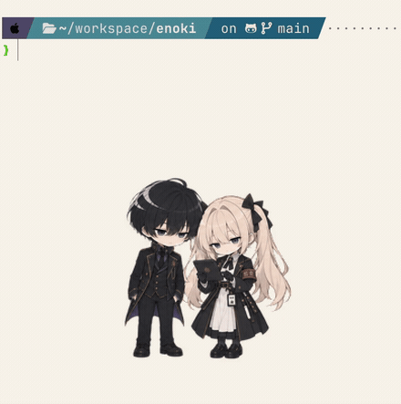

# Enoki

> A small desktop companion that lets your characters live beside you.

macOS のデスクトップにキャラクターが常駐し、時間帯や状況に合わせて声をかけてくれる
デスクトップマスコットアプリです。公式デモキャラクターとして **御影栞** を同梱しているので、
clone してすぐ動かせます（デモアセットは自由素材ではありません → [License](#license)）。

- **ネットワーク通信・テレメトリは一切ありません。** 台詞は手元の JSON から選ぶだけで、
  生成 AI も外部 API も使いません。
- **アクセシビリティ／画面収録／入力監視の権限を要求しません。** 見ているのは時刻と自分の状態だけです。
- **自分のキャラクターに差し替えて使えます** → [docs/customization.md](docs/customization.md)

<p align="center">
  
</p>

> この録画は**開発者の環境**のものです（2 人組 + 私服プロファイルへの着替え）。
> **同梱のデモキャラクターは栞ひとり**で、ここに写っているアセットはリポジトリに含まれていません。
> 台詞とスプライトを差し替えれば、人数や衣装も含めて自分のキャラクターにできます
> （→ [docs/customization.md](docs/customization.md)）。

---

## Features

現在実装されている機能です。

- **デスクトップ常駐** — キャラクターを画面の好きな位置にドラッグで置けます。
  全スペースに表示、常に最前面、クリック透過、表示倍率（50〜150%）を切り替えられます。
- **待機・居眠り・リアクション** — 待機アニメーションを数種類ランダムに切り替え、無操作が続くと居眠りし、
  クリックすると手を振ったり跳ねたりします。
- **時間帯・状況に応じた声かけ** — 仕事・水分・休憩・昼食・励まし・雰囲気の各カテゴリを、
  時刻と周期（例: 休憩は 50〜60 分おき、昼食は 11:30〜14:00）で選んで吹き出しに出します。
- **`dialogue.json` による会話データ管理** — 台詞は JSON で管理します。アプリを組み直さずに
  差し替えられます。**1 人でも複数人でも**書けて、吹き出しの名前と立ち位置も JSON で決まります。
- **静かにしてもらう / 仕事中モード** — 「1 時間静かに」「今日の仕事終了まで」「会話 OFF」や、
  仕事中かどうかで話すカテゴリを変える切り替えがメニューにあります。
- **キャラクタースプライトの差分** — スプライトシートを差し替えるだけで見た目を変えられます。
  衣装違いなどを見た目プロファイルごとに割り当てられます。
- **曜日・日付に応じた Appearance 切り替え** — 土日・祝日・特定イベント日などの条件で、
  見た目と話す内容を自動的に切り替えます。
- **特別な日・イベントへの拡張** — プロファイルごとに使う台詞カテゴリを制限したり、
  イベント当日だけの台詞や、開始前・進行中・終了後で切り替わる差分を足したりできます。
- **メニューバーから操作** — Dock には出ません。ログイン時の自動起動にも対応しています。

## Requirements

| 項目 | 内容 |
|---|---|
| 対応 OS | **macOS 13 (Ventura) 以降** |
| 動作確認済み | **macOS 26 / Apple Silicon / Swift 6.2.4** でのみ確認しています。Intel Mac 向けのユニバーサルビルドは可能ですが未検証です。Windows / Linux では動きません（AppKit 依存） |
| 必要なツールチェイン | **Swift 5.9 以降**（Xcode 15 以降、または同等の Command Line Tools）。`Package.swift` の `swift-tools-version` が 5.9 です |
| パッケージマネージャ | **Swift Package Manager**（Swift ツールチェイン同梱。別途インストールするものはありません） |
| 外部依存 | **なし。** サードパーティのパッケージを 1 つも使っていないので、**オフラインでもビルドできます** |
| 任意のツール | スプライト生成スクリプトを使う場合のみ Python 3 + `pillow` / `numpy`（`pip3 install pillow numpy`） |

```bash
swift --version          # 5.9 以上であることを確認
xcode-select -p          # Command Line Tools のパスが出れば OK
```

Xcode プロジェクト（`.xcodeproj`）はありません。`make` と `swift` だけで完結します。

## Installation / Development

```bash
git clone https://github.com/hsm-hx/enoki.git
cd enoki

make run      # ビルドして build/Enoki.app を組み立て、起動する
```

**依存パッケージのインストール手順はありません**（外部依存ゼロ）。`make run` がそのまま
ビルドと起動を行います。メニューバーにアイコンが出れば起動しています。表示・会話・見た目の設定と
終了は、すべてこのメニューから行います。

開発中によく使うコマンド:

| コマンド | 何をするか |
|---|---|
| `make build` | `swift build`（デバッグビルド） |
| `make test` | `swift test`（167 件のユニットテスト） |
| `make run` | `.app` を組み立てて起動 |
| `make app` | 配布用の `build/Enoki.app` を組み立てる |
| `make install` | `~/Applications` へコピー |
| `make clean` | `.build` と `build` を削除 |
| `swift run Enoki` | `.app` を作らずに直接起動（ログイン項目の登録だけは `.app` が必要） |

### 環境変数

**設定ファイル（`.env` など）も API キー・トークンも必要ありません。**
Enoki はネットワークにアクセスしないので、外部サービスの認証情報を一切使いません。
開発時に使える環境変数は次の 3 つだけで、いずれも任意です。

| 環境変数 | 用途 |
|---|---|
| `ENOKI_SKIN_DIR` | スキン（キャラクター）のフォルダを直接指定する。他の解決順より優先されます |
| `ENOKI_DEBUG_SPEAK_ON_LAUNCH` | `1` にすると起動 2 秒後に 1 回しゃべる（吹き出しの確認用） |
| `ENOKI_DEBUG_SPEAK_ID` | 上と併用して、しゃべらせる会話 id を指定する |

```bash
# 同梱のデモキャラクターで起動して、台詞を 1 回出す
ENOKI_SKIN_DIR=Sources/Enoki/Resources/DefaultSkin \
  ENOKI_DEBUG_SPEAK_ON_LAUNCH=1 swift run Enoki
```

ログは `os.Logger` に出ます。

```bash
log show --style compact --info --last 5m --predicate 'subsystem == "com.enoki.mascot"'
```

## Build

配布用の `.app` は `scripts/build_app.sh`（= `make app`）で組み立てます。

```bash
make app                    # build/Enoki.app を作る
UNIVERSAL=1 make app        # arm64 + x86_64 のユニバーサルバイナリ
make install                # ~/Applications へコピー
```

署名は既定でアドホック署名（`codesign --sign -`）です。自分の Mac でビルドしたものはそのまま開けますが、
他の人に配る場合は Developer ID 署名と公証が必要です。

```bash
CODESIGN_IDENTITY="Developer ID Application: Your Name (TEAMID)" make app
```

## Customize your characters

Enoki は **台詞（`dialogue.json`）** と **スプライトシート（画像）** を差し替えれば、
同梱のデモ以外のキャラクターで動かせます。

- **台詞を変える** — `dialogue.json` を書き換えます。使用中スキンのフォルダに置けば、
  アプリを組み直さずに差し替えられます。**1 人用でも複数人用でも書けます**（話者の名前と
  吹き出しの立ち位置も JSON で指定でき、1 人なら自動で中央に出ます）。
- **スプライトを変える** — 8 列 × 9 行（1 コマ 192×208px）の透過 PNG と `pet.json` を
  フォルダにまとめて置きます。
- **自分のキャラクターを住まわせる** — 上の 2 つを揃えれば、あなたのキャラクターが
  デスクトップの住人になります。プロファイルを足せば、曜日やイベントに応じた差分も作れます。
- **人数を増やす** — 1 コマに 2 人以上描いて `speakers` を宣言すれば、掛け合いもできます。

**書き換えて使えるサンプル**が [`examples/`](examples/) にあります。フォルダごとコピーして、
`pet.json`（名前）と `dialogue.json`（台詞）を書き換え、スプライトを差し替えれば自分のキャラクターになります。

```bash
cp -R examples/solo ~/.codex/pets/my-character
cp Sources/Enoki/Resources/DefaultSkin/spritesheet.png ~/.codex/pets/my-character/
ENOKI_SKIN_DIR=~/.codex/pets/my-character swift run Enoki
```

手順とファイル仕様は **[docs/customization.md](docs/customization.md)** にまとめています。

### スプライト形式について（Codex Pet 形式との非公式互換）

Enoki は **Codex Pet のアセット形式（`pet.json` + 8 列 × 9 行のスプライトシート）と
非公式に互換**です。同じ形式のフォルダをそのまま読み込めるようにしてあり、
`~/.codex/pets/` 配下も探索先のひとつにしています。

> **Enoki は OpenAI とは無関係で、OpenAI による承認・提携・推奨を受けたものではありません。**
> 互換性は非公式なもので、先方の仕様変更で動かなくなる可能性があります。
> このリポジトリには Codex / OpenAI 由来の公式アセットを一切含めていません。

`manifest.json` + ストリップ画像の形式にも対応しています（→ [docs/architecture.md](docs/architecture.md) §6）。

### 同梱のデモキャラクターについて

同梱しているデモキャラクター **御影栞** は Enoki の**公式デモキャラクター**です。
動作確認や差し替え手順を試すために自由に使えますが、**自由素材ではありません**
（CC0 でも MIT でもありません）。再配布・商用利用・別作品への転用は許諾していません。
詳しくは [ASSETS_LICENSE.md](ASSETS_LICENSE.md) を読んでください。

## Known limitations

現時点で分かっている制限です（v0.1.0）。

- **動作確認は macOS 26 / Apple Silicon のみ**です。Intel Mac・他の macOS バージョンは未検証、
  Windows / Linux では動きません。
- **1 プロセスにつきキャラクターは 1 体**です（複数体を同時に表示することはできません）。
  2 人組に見せるには 1 枚の絵に 2 人を描きます。
- **キャラクターの差し替えは JSON とファイル配置で行います。** GUI のキャラクターエディタや
  アプリ内からの切り替え機能はありません。
- **設定ウィンドウはありません。** すべてメニューバーから操作します。細かい調整
  （台詞・見た目プロファイル）は JSON の編集が必要です。
- **スキンと台詞のホットリロードはありません。** ファイルを書き換えたら、メニューの
  「スキン > 再読み込み」を押してください。
- **台詞は JSON からの選択だけ**で、生成はしません。同梱のデモは 30 会話なので、
  長く使うと同じ台詞が回ってきます。
- **声かけは完全に時間ベース**です。実際に作業しているかどうかは見ていません
  （入力内容・画面・他アプリを一切読まないため）。離席（居眠り状態）のときだけ黙ります。
- **素材は 1x** なので Retina では拡大表示になります（`mascot.pixelScale` で 2x 素材にも対応）。
- **日本語固定**です（UI のローカライズはしていません）。
- **署名はアドホック署名**です。他の人に配布する場合は Developer ID 署名と公証が必要です。

もう少し細かい制限は [docs/architecture.md](docs/architecture.md) の §10 にあります。

## Documentation

| ドキュメント | 内容 |
|---|---|
| [examples/](examples/) | 書き換えて使うサンプル（1 人用 / 2 人用の `pet.json` + `dialogue.json`、プロファイル例） |
| [docs/customization.md](docs/customization.md) | 自分のキャラクターへの差し替え方（台詞・スプライト・プロファイル） |
| [docs/architecture.md](docs/architecture.md) | 開発者向けの内部ドキュメント（設計・スキン形式・会話ロジックの詳細） |
| [CONTRIBUTING.md](CONTRIBUTING.md) | Issue / PR の出し方、開発の進め方 |
| [CHANGELOG.md](CHANGELOG.md) | 変更履歴 |

## Contributing

バグ報告・機能提案・質問は [Issues](https://github.com/hsm-hx/enoki/issues) で受け付けています。
PR の送り方、開発の進め方、アセットを追加するときの注意は
**[CONTRIBUTING.md](CONTRIBUTING.md)** を読んでください。

変更履歴は [CHANGELOG.md](CHANGELOG.md) にあります。

## License

**コードとキャラクターアセットで条件が異なります。**

- **ソースコード**: [MIT License](LICENSE)
- **キャラクターアセット**（公式デモキャラクター「御影栞」のスプライト、キャラクターデザイン、
  同梱の台詞テキスト）: MIT License の**対象外**です。自由素材ではありません。
  条件は [ASSETS_LICENSE.md](ASSETS_LICENSE.md) を読んでください。

自分のキャラクターアセットに差し替えたうえでなら、Enoki 本体は MIT License の範囲で自由に
利用・改造・再配布できます。
