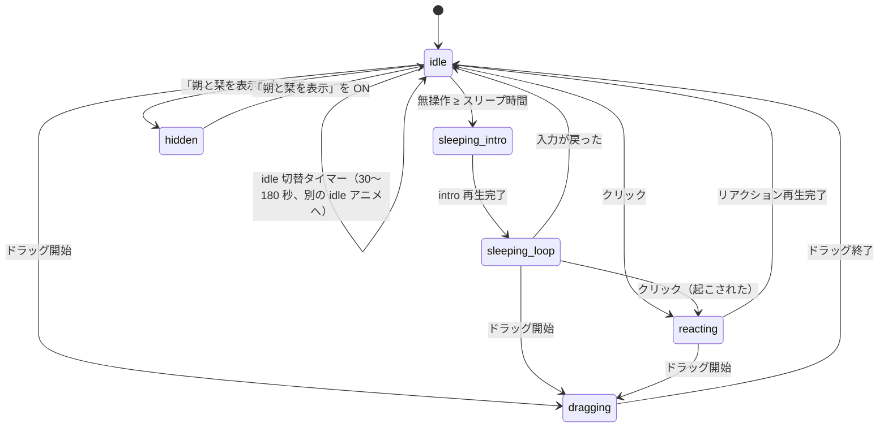

# 朔と栞 (Enoki)

macOS のデスクトップに常駐する 2 人組マスコットです。Codex の Pet 用スプライトシート
（`~/.codex/pets/sakushio_pet`）をそのまま読み込んで、透明ウィンドウの中で動かします。

- **ネットワーク通信・テレメトリ・外部プロセス起動は一切しません。**
- **アクセシビリティ／画面収録／入力監視の権限を要求しません。**
- 設定は `UserDefaults` のみ。ログは `os.Logger`（subsystem `com.enoki.mascot`）のみで、ファイルには書きません。
- Swift Package Manager だけでビルドします（`.xcodeproj` はありません）。

---

## 1. すぐ使う

```bash
make app          # .app を build/Enoki.app に組み立てる
make run          # 組み立てて起動する
make install      # ~/Applications へインストール
make test         # ユニットテスト
```

メニューバーに人が 2 人並んだアイコン（`person.2.fill`）が出れば起動しています。
Dock には出ません（`LSUIElement`）。

---

## 2. アーキテクチャ

### ターゲット構成

| ターゲット | 依存 | 役割 |
|---|---|---|
| `EnokiCore` | Foundation / CoreGraphics / ImageIO | AppKit に依存しない純ロジック。スキンの読み込み、状態遷移、位置計算、設定。**テスト対象はここ。** |
| `Enoki` | AppKit + `EnokiCore` | 実行ファイル。ウィンドウ・描画・タイマー・メニューバー・システム連携。 |
| `EnokiCoreTests` | XCTest + `EnokiCore` | 43 件のユニットテスト。 |

### ファイル

```
Sources/EnokiCore/
  Skin/SkinModels.swift          SpriteSheet / SpriteAnimation / StateMapping / Skin / SkinError
  Skin/CodexPetDefaults.swift    Codex Pet 形式の既定グリッド・9 行の定義・既定 states
  Skin/CodexPetLoader.swift      pet.json 形式のローダ（+ mascot 拡張キー）
  Skin/StripManifestLoader.swift manifest.json（ストリップ形式）のローダ
  Skin/SkinLoader.swift          形式判定と解決順
  Skin/AlphaMask.swift           ヒットテスト用アルファマスク
  State/MascotState.swift        状態の列挙
  State/MascotStateMachine.swift 状態遷移（純ロジック・タイマー非依存）
  Settings/AppSettings.swift     UserDefaults ラッパと変更通知
  Geometry/WindowPlacement.swift 位置のクランプ・既定位置（純関数）

Sources/Enoki/
  main.swift                     NSApplication のセットアップ
  AppDelegate.swift              MascotController と StatusMenuController の生成
  Mascot/MascotWindow.swift      NSPanel サブクラス（透明・非アクティブ化）
  Mascot/MascotView.swift        CALayer 描画・アルファヒットテスト・ドラッグ/クリック
  Mascot/SpritePlayer.swift      コマ送り（DispatchSourceTimer をコマごとに再スケジュール）
  Mascot/MascotController.swift  全部の結線（+ 内蔵リソースの解決）
  MenuBar/StatusMenuController.swift  NSStatusItem とメニュー
  System/IdleMonitor.swift       無操作時間のポーリング
  System/LoginItemManager.swift  SMAppService によるログイン項目
  Resources/DefaultSkin/         内蔵スキン（pet.json + spritesheet.png）
  Resources/AppIcon/icon-1024.png
```

### データフロー

```
  UserDefaults ──► AppSettings ──(NotificationCenter)──► MascotController
                                                            │
  ~/.codex/pets ──► SkinLoader ──► Skin ─────────────────────┤
                                                            │
  CGEventSource ──► IdleMonitor ──(秒数)──► MascotStateMachine
                                               │  Effect (play / schedule / pause …)
                                               ▼
                        SpritePlayer ──(コマ)──► MascotView ──► CALayer.contentsRect
                                                            └─► MascotWindow (NSPanel)
```

`MascotStateMachine` は `Date` もタイマーも触りません。`handle(_ event:, now:) -> [Effect]` という
純粋な関数として書かれていて、時刻・乱数は外から注入します。実際のタイマーは
`MascotController` が `DispatchSourceTimer` で持ちます。これによって状態遷移だけを単体テストできます。

---

## 3. 使用している macOS API（すべて公開 API・権限不要）

| API | 用途 | 権限 |
|---|---|---|
| `NSPanel`（`.borderless` + `.nonactivatingPanel`） | 透明・枠なし・クリックしてもアプリがアクティブにならないウィンドウ | 不要 |
| `NSWindow.collectionBehavior` | 全スペースに表示 / フルスクリーン補助 | 不要 |
| `CALayer.contents` + `contentsRect` | スプライトシートの表示とコマ切替 | 不要 |
| `CATransaction.setDisableActions(true)` | 暗黙アニメーションの抑制 | 不要 |
| `CGImageSource`（ImageIO） | PNG / WebP のデコード | 不要 |
| `CGContext`（`alphaOnly`） | ヒットテスト用アルファマスクの生成 | 不要 |
| `CGEventSource.secondsSinceLastEventType` | 無操作時間の取得（**入力内容は取得しない**） | 不要 |
| `DispatchSourceTimer` | コマ送り・idle 切替・無操作ポーリング | 不要 |
| `NSStatusItem` / `NSMenu` / `NSMenuDelegate` | メニューバー | 不要 |
| `NSImage(systemSymbolName:)` | メニューバーアイコン（SF Symbols） | 不要 |
| `NSOpenPanel` | スキンフォルダの選択 | 不要（ユーザーが選んだ範囲のみ） |
| `SMAppService.mainApp` | ログイン時の自動起動 | 不要（「システム設定 > 一般 > ログイン項目」に表示される） |
| `NSWorkspace.shared.notificationCenter` | スリープ／復帰、ユーザー切替の検知 | 不要 |
| `NSWindow.didChangeOcclusionStateNotification` | 完全に隠れたら再生を止める | 不要 |
| `NSApplication.didChangeScreenParametersNotification` | 画面構成の変化で位置を再検証 | 不要 |
| `UserDefaults` | 設定の保存 | 不要 |
| `os.Logger` | ログ（subsystem `com.enoki.mascot`） | 不要 |

**使っていないもの**: ネットワーク（URLSession 等）、Accessibility API、CGEventTap、
画面収録（CGWindowListCreateImage 等）、`NSTask` / `Process`、private API。

---

## 4. スプライト再生方式

- スプライトシートは **1 枚の `CGImage`** として読み込み、`layer.contents` に一度だけ設定します。
- コマ切替は **`layer.contentsRect`（単位座標）を書き換えるだけ**です。`SpriteAnimation.contentsRect`
  は左上原点ですが、macOS の CALayer（非 flipped ビュー）では contentsRect の原点が左下になるため、
  `MascotView.layerContentsRect` で Y を反転してから渡します（反転し忘れると行が上下逆になり、
  別の行のアニメーションが表示されます）。
  ビットマップの再生成も `draw(_:)` も行いません。
  `CATransaction.setDisableActions(true)` で暗黙アニメーションを止めています。
- タイマーは `DispatchSourceTimer`（main queue）で、**そのコマの表示時間ぶんだけ待って再スケジュール**します。
  Codex の素材はコマごとに表示時間が違う（例: idle は 280/110/110/140/140/320 ms）ため、
  固定 fps ループでは正しく再現できません。CADisplayLink も 60fps ループも使いません。
  `leeway` は 15ms で、OS がタイマーを束ねられるようにしています。
- **コマが 1 枚のループはタイマーを立てません**（完全な静止画になり CPU を使いません）。
- idle の実効フレームレートは概ね 3〜9fps 程度です（1 ループ約 1.1 秒に 6 コマ）。

### 再生を止める条件

| 条件 | 動作 |
|---|---|
| マスコットを非表示にした | `player.pause()` + 全タイマー停止 |
| ウィンドウが完全に隠れた（`occlusionState` に `.visible` が無い） | pause |
| システムがスリープする（`willSleepNotification`） | pause |
| ユーザー切替で非アクティブ（`sessionDidResignActiveNotification`） | pause |
| 復帰（`didWakeNotification` / `sessionDidBecomeActiveNotification`） | resume |
| スリープ時間 = 「スリープしない」 | 無操作ポーリング自体を停止 |

---

## 5. 状態遷移



| 状態 | 既定アニメーション（sakushio_pet） | 補足 |
|---|---|---|
| `idle` | `idle` / `idle` / `idle` / `review` / `running` からランダム（重複で重み付け） | 30〜180 秒ごとに別の idle へ切り替え |
| `sleeping(intro)` | `waiting`（row 6、非ループ） | 1 度だけ再生 |
| `sleeping(loop)` | `sleep`（row 6 の frame 4,5 = sleep_01/02、1400ms ずつ） | 目を閉じてループ |
| `dragging` | `running-right`（row 1） | ドラッグ中はスリープ判定しない |
| `reacting` | `waving` か `jumping` からランダム（非ループ） | 完了後 300ms はクリックを無視 |
| `hidden` | なし | タイマー全停止 |

- リアクション中のクリックは無視します（デバウンス）。
- 無操作時間のポーリングは通常 5 秒、スリープ中は 1 秒。「スリープしない」設定では停止します。

---

## 6. スキン形式

### 6.1 解決順

1. 環境変数 `ENOKI_SKIN_DIR`（開発用）
2. `UserDefaults` の `skinDirectory`（メニューで選んだフォルダ）
3. `~/.codex/pets/sakushio_pet`
4. アプリ内蔵の `DefaultSkin`

各候補は「フォルダが存在し、`pet.json` か `manifest.json` がある」ときだけ採用します。
読み込みに失敗したら次の候補へ進み、最後まで失敗したらアラートを出して終了します。

```bash
# 開発時に別のスキンで試す
ENOKI_SKIN_DIR=~/my_pet ./build/Enoki.app/Contents/MacOS/Enoki
```

### 6.2 Codex Pet 形式（`pet.json` + スプライトシート）

`pet.json` があればこの形式です（`manifest.json` より優先）。

```json
{
  "id": "sakushio",
  "displayName": "朔と栞",
  "spritesheetPath": "spritesheet.webp"
}
```

- `spritesheetPath` が読めない場合は、同名の `.png` → `.webp`、さらに `spritesheet.png` →
  `spritesheet.webp` の順にフォールバックします。WebP は ImageIO が macOS 11+ でデコードできます。
- シートは **8 列 × 9 行、1 セル 192×208 px（合計 1536×1872 px）**、透過。未使用セルは完全透明。
- `grid` を書かない場合は、画像サイズを 8×9 で割ってセルサイズを推定します。
- 既定の 9 行を使うとき、**完全に透明なセルは再生コマから外します**（下表のコマ数は上限）。
  素材が既定より短い行（例: `running-right` が 6 コマしか無い）でも、空セルが表示されて
  キャラクターが消える瞬間ができません。行がまるごと透明な場合だけ既定のコマ数を保ちます。
  `mascot.animations` で `frames` を明示した場合は書いたとおりに再生します。

#### 既定の 9 行（Codex 固定）

| row | 名前 | コマ数（上限） | 各コマの表示 ms | ループ |
|---:|---|---:|---|---|
| 0 | `idle` | 6 | 280, 110, 110, 140, 140, 320 | ✓ |
| 1 | `running-right` | 8 | 120×7, 220 | ✓ |
| 2 | `running-left` | 8 | 120×7, 220 | ✓ |
| 3 | `waving` | 4 | 140×3, 280 | — |
| 4 | `jumping` | 5 | 140×4, 280 | — |
| 5 | `failed` | 8 | 140×7, 240 | — |
| 6 | `waiting` | 6 | 150×5, 260 | —（スリープ導入に使うため非ループ） |
| 7 | `running` | 6 | 120×5, 220 | ✓ |
| 8 | `review` | 6 | 150×5, 280 | ✓ |

これに加えて、row 6 の frame 4,5（`sleep_01` / `sleep_02`）を使う `sleep`（1400ms×2、ループ）を
既定で定義しています。

#### `mascot` 拡張キー

`pet.json` に `"mascot"` を足しても Codex 側は無視するので、同じファイルを共用できます。

```json
"mascot": {
  "grid": {"columns": 8, "rows": 9, "cellWidth": 192, "cellHeight": 208},
  "pixelScale": 1,
  "animations": {
    "idle":  {"row": 0, "frames": [0,1,2,3,4,5], "durations": [280,110,110,140,140,320], "loop": true},
    "sleep": {"row": 6, "frames": [4,5], "durations": [1400,1400], "loop": true},
    "quick": {"row": 3, "fps": 12}
  },
  "states": {
    "idle": ["idle", "idle", "idle", "review", "running"],
    "idleSwitchSeconds": [30, 180],
    "sleep": {"intro": "waiting", "loop": "sleep"},
    "drag": "running-right",
    "reaction": ["waving", "jumping"]
  }
}
```

| キー | 意味 |
|---|---|
| `grid.columns` / `rows` / `cellWidth` / `cellHeight` | シートの分割。省略時は 8×9 / 画像サイズから推定。 |
| `pixelScale` | 画像 1px が何 pt か。`2` なら Retina 素材として半分の pt サイズで表示。既定 `1`。 |
| `animations.<名前>.row` | **必須。** 使用する行。 |
| `animations.<名前>.frames` | 使用する列の配列。省略時は「既定表にある名前ならその既定コマ数」、無ければ**行内の非透明セルを左から数えます**（アルファマスクで判定）。 |
| `animations.<名前>.durations` | ms の配列。**1 要素だけなら全コマに適用**。コマ数より短ければ最後の値で埋めます。 |
| `animations.<名前>.fps` | `durations` の代わりに使えます（`1000/fps` ms）。 |
| `animations.<名前>.loop` | 省略時は既定表の値、無ければ `true`。 |
| `states.idle` | idle プール。**同じ名前を複数書くと重み付け**になります。 |
| `states.idleSwitchSeconds` | `[下限, 上限]` 秒。既定 `[30, 180]`。 |
| `states.sleep` | `{"intro": …, "loop": …}`。`intro` に `null` を書くと導入なし。文字列を書くと loop だけの指定になります。 |
| `states.drag` | ドラッグ中のアニメーション名。 |
| `states.reaction` | クリック時のリアクション候補。 |

`mascot` が無い／一部しか無い場合は**既定値とマージ**します（`animations` は名前単位、`states` はキー単位の上書き）。
`states` が存在しないアニメーション名を指すとエラーになり、次の候補スキンへフォールバックします。

### 6.3 ストリップ形式（`manifest.json`）

1 アニメーション = 1 画像（横に並んだコマ）の形式です。`pet.json` が無いときだけ使われます。

```json
{
  "displayName": "朔と栞",
  "pixelScale": 1,
  "animations": {
    "idle_1": {"file": "idle_1.png", "frameCount": 4, "frameWidth": 192, "frameHeight": 208, "fps": 6, "loop": true},
    "sleep":  {"file": "sleep.png",  "frameCount": 2, "frameWidth": 192, "frameHeight": 208, "durations": [1400,1400], "loop": true}
  },
  "states": { "…§6.2 と同じ形式…" }
}
```

- コマは画像内を左→右、上→下に `frameWidth×frameHeight` で切ります（列数 = 画像幅 ÷ frameWidth）。
- `frameCount` 省略時は画像内の全セル。`frameWidth` / `frameHeight` 省略時は画像サイズと
  `frameCount` から推定します。
- `states` 省略時の推定: `idle` = 名前が `idle` で始まるもの全部、`sleep` = `sleep`、
  `drag` = `drag`、`reaction` = `reaction` で始まるもの全部。
  無いものは idle の先頭にフォールバックします。

---

## 7. メニュー

```
✓ 朔と栞を表示
──────────
✓ 常に最前面
  クリック透過（ドラッグ・クリック不可）
  表示倍率            ▸ 50% / 75% / ✓100% / 125% / 150%
  描画補間            ▸ ✓なめらか (Linear) / くっきり (Nearest)
  スリープまでの時間  ▸ 1分 / 3分 / ✓5分 / 10分 / 15分 / 30分 / ─ / スリープしない
──────────
  スキン              ▸ 現在: 朔と栞（~/.codex/pets/sakushio_pet）
                        ─
                        （~/.codex/pets 直下のスキンを列挙、選択中に ✓）
                        ─
                        フォルダを選択…
                        内蔵スキンを使用
                        再読み込み
──────────
  ログイン時に自動起動
  位置をリセット
──────────
  Enoki について
  終了                 ⌘Q
```

メニューを開くたびに（`menuNeedsUpdate`）内容を作り直すので、
ログイン項目の状態やスキンの一覧は常に最新になります。

### 操作

- **ドラッグ**: マスコットを掴んで移動。離すとマウスのある画面に収まるようにクランプして保存します。
- **クリック**: リアクション（手を振る／跳ねる）。スリープ中なら起こしてからリアクションします。
- **表示倍率の変更**: 足元（下端中央）を固定したままサイズが変わります。

### 設定キー（UserDefaults）

| キー | 型 | 既定値 |
|---|---|---|
| `isVisible` | Bool | `true` |
| `alwaysOnTop` | Bool | `true` |
| `clickThrough` | Bool | `false` |
| `scale` | Double | `1.0` |
| `interpolation` | String | `"linear"`（`linear` \| `nearest`） |
| `sleepAfterSeconds` | Int | `300`（`0` = スリープしない） |
| `skinDirectory` | String? | なし |
| `windowOriginX` / `windowOriginY` / `hasSavedWindowOrigin` | Double / Bool | なし |

```bash
# 設定を全部消したいとき
defaults delete com.enoki.mascot
```

---

## 8. 権限とセキュリティ

- **要求する権限はありません。** アクセシビリティ、画面収録、入力監視、フルディスクアクセス、
  いずれも不要です。無操作時間は `CGEventSource.secondsSinceLastEventType` で
  「最後の入力からの秒数」だけを読み、キーの内容は一切取得しません。
- ネットワークアクセスはコード上ゼロです（`URLSession` も `Network.framework` も import していません）。
- サンドボックスは有効にしていません（`~/.codex/pets` を直接読むため）。
- 署名は既定で**アドホック署名**（`codesign --sign -`）です。自分の Mac でビルドしたものは
  Gatekeeper にブロックされずそのまま開けます。他人に配る場合は Developer ID 署名と公証が必要です。

```bash
CODESIGN_IDENTITY="Developer ID Application: あなたの名前 (TEAMID)" make app
```

---

## 9. ビルド

```bash
make build                  # swift build（デバッグ）
make test                   # swift test
make app                    # build/Enoki.app を組み立てる
UNIVERSAL=1 make app        # arm64 + x86_64 のユニバーサルバイナリ
make run                    # 組み立てて起動
make install                # ~/Applications にコピー
make clean
```

`scripts/build_app.sh` がやっていること:

1. `swift build -c release`（`UNIVERSAL=1` なら `--arch arm64 --arch x86_64`）
2. `build/Enoki.app/Contents/{MacOS,Resources}` を作り、実行ファイル・`Info.plist`・`PkgInfo` を配置
3. SwiftPM のリソースバンドル `Enoki_Enoki.bundle` を `Contents/Resources/` へコピー
4. `Sources/Enoki/Resources/AppIcon/icon-1024.png` から `sips` + `iconutil` で `AppIcon.icns` を生成
5. `codesign --force --deep --sign "${CODESIGN_IDENTITY:--}"`

### .app の配置と自動起動

- `make install` で `~/Applications/Enoki.app` に入ります。`/Applications` でも構いません。
- 自動起動は `SMAppService.mainApp` を使います。**`.app` として起動していないと登録できません**
  （`swift run` で直接起動した場合はアラートが出ます）。
- 登録後に **`.app` を別の場所へ移動すると登録が無効になります**。移動したら
  「ログイン時に自動起動」を一度 OFF → ON し直してください。
- 登録が `requiresApproval` になった場合は「システム設定 > 一般 > ログイン項目」で有効にしてください
  （アラートの「システム設定を開く」ボタンから飛べます）。

---

## 10. 既知の制約・未実装

- **ドラッグ方向の判定をしていません。** Codex 形式には `running-right` / `running-left` が
  ありますが、どちらに動かしても `running-right` を再生します。
  付属素材ではどちらの行もほぼ同じ絵柄なので見た目は変わりません。
- **素材が 1x なので Retina では拡大表示**になります（1 セル 192×208px = 192×208pt）。
  `mascot.pixelScale` を `2` にすれば 2x 素材として扱えますが、付属素材は 1x です。
  ぼやけが気になる場合はメニューの「描画補間 > くっきり (Nearest)」を選んでください。
- **設定ウィンドウはありません。** すべてメニューバーから操作します。
- **透明ピクセルのクリック透過は macOS の標準挙動に依存**します。非 opaque ウィンドウでは
  透明部分のクリックが下のウィンドウへ抜けます。加えて `MascotView.hitTest` でアルファマスクを見て
  透明部分では `nil` を返し、透明部分からドラッグが始まらないようにしています。
  ただし「下のアプリが必ずクリックを受け取る」ことはアプリ側からは保証できません。
- **複数体の表示には対応していません**（1 プロセス 1 体）。
- **スキンのホットリロード（ファイル監視）はありません。** メニューの「再読み込み」を使ってください。
- **`sleep` の判定は「最後の入力からの秒数」だけ**です。動画視聴中など、入力が無くても
  作業している状況ではスリープします。
- アイコン以外のローカライズはしていません（日本語固定）。

---

## 11. 将来の拡張ポイント

| やりたいこと | 触る場所 |
|---|---|
| 新しい状態（例: 通知を受けて `failed` を再生） | `EnokiCore/State/MascotStateMachine.swift` に `Event` / `Effect` を足す。UI 側は `MascotController.apply(_:)` に分岐を足すだけ。 |
| ドラッグ方向で `running-left` / `running-right` を切り替える | `MascotView.mouseDragged` で移動方向を求め、`Event.dragBegan` に方向を持たせる。`StateMapping` に `dragLeft` / `dragRight` を追加。 |
| 吹き出し・会話 UI | `MascotWindow` の兄弟として別の `NSPanel` を作り、`MascotController` から出し入れする。テキスト生成を足す場合も、**ネットワークを使うならこの README の「権限とセキュリティ」を書き換えること。** |
| 外部から状態を通知（CI 失敗で `failed` を出す等） | `DistributedNotificationCenter` か、`~/Library/Application Support` 配下のファイル監視を `System/` に追加し、`MascotController` から `Event` を流す。 |
| 複数体の表示 | `MascotController` を複数インスタンス化できるようにし、`AppSettings` をインスタンスごとの suite 名に分ける。 |
| スキンのホットリロード | `System/` に `DispatchSource.makeFileSystemObjectSource` ベースの監視を足し、`MascotController.reloadSkin()` を呼ぶ。 |
